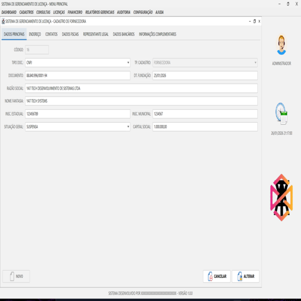
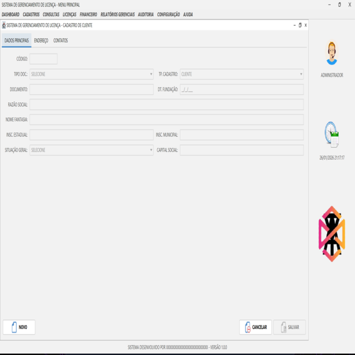
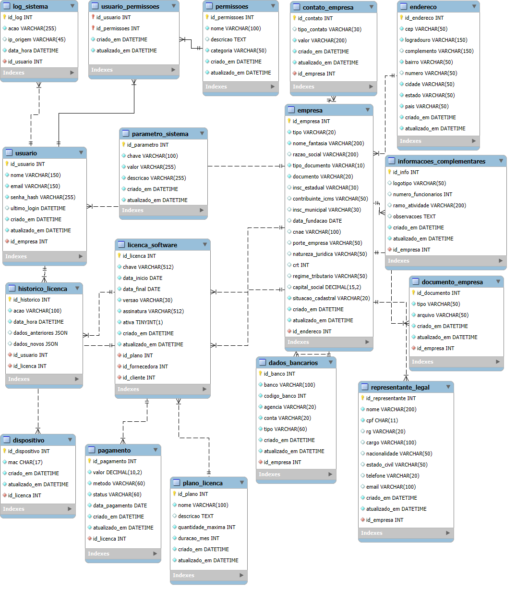

# 🛡️ Gerenciador de Licença

**Status do Projeto:** 🚀 Em desenvolvimento ativo  
**Plataforma:** Java 21 LTS  

Aplicação desktop corporativa para gerenciamento de licenças de software e cadastros empresariais,  
com foco em **segurança híbrida**, **arquitetura modular** e **alta performance com threads virtuais**.  

Aplicação desktop desenvolvida em **Java 21**, voltada ao gerenciamento empresarial (clientes e fornecedores).  
O sistema implementa **segurança nativa**, criptografia híbrida e uma interface moderna, sem dependência de frameworks externos de licenciamento.  

---

## 📺 Demonstração (Prints)

 

*Fornecedor (7 abas configuradas) vs Cliente (interface simplificada)*

---

## ✨ Diferenciais Técnicos

### 🔒 Segurança e Criptografia Híbrida
A proteção de dados é estruturada em três pilares:

- **Persistência de Configurações (AES):** As credenciais do banco de dados (URL, Usuário e Senha) são protegidas por criptografia simétrica. Isso permite que o sistema descriptografe os dados em tempo de execução para realizar a conexão via **HikariCP**, mantendo o arquivo **db.properties** seguro.
- **Autenticação (BCrypt):** As senhas dos usuários para login no sistema utilizam hashing irreversível, garantindo que mesmo em caso de acesso à base de dados, as senhas originais não possam ser expostas.
- **Integridade e Licenciamento (RSA):** Implementação de **RSA** para validação de chaves de licença e gerenciamento de MasterKey simplificada.

---

### ⚡ Performance com Java 21
- **Virtual Threads:** Operações de CRUD e consultas pesadas rodam em threads virtuais. Isso evita o travamento da **EDT (Event Dispatch Thread)** do Swing, mantendo a UI fluida.
- **Modern Java:** Uso de **switch expressions**, **records** e **Pattern Matching** para um código limpo e performático.

---

### 🎨 Interface Moderna (Swing MDI)
- **Visual:** Look and Feel através do **FlatLaf** (Temas modernos).
- **Layout:** Responsividade interna com **MigLayout**.
- **Arquitetura:** Uso de **Factories** para instanciar as **JInternalFrames**, garantindo baixo acoplamento.

---

## 🛠️ Stack Tecnológica

- **Linguagem:** ☕ Java 21 (LTS)
- **UI Framework:** 🎨 Swing + FlatLaf + MigLayout
- **Banco de Dados:** 🗄️ MySQL 8.4.0 (17 tabelas)
- **Connection Pool:** 🔌 HikariCP
- **Validações:** ✅ Caelum Stella (CPF/CNPJ) & Libphonenumber

---

## 📂 Estrutura de Pastas (Arquitetura por Módulos)

O projeto adota uma estrutura de **MVC com Sub-pacotamento**, organizada para suportar a complexidade das 17 tabelas e interfaces multi-abas:

```text
src/main/java/com/br/yat/gerenciador/
├── app/                  # Ponto de entrada (Main)
├── config/               # Infraestrutura (HikariCP, Banco de Dados)
├── controller/           # Camada de Controle (Sub-dividida por módulos)
│   ├── empresa/          # Controllers das 7 abas de Empresa
│   ├── licenca/          # Lógica de controle de licenças
│   └── ...               # Outros módulos
├── dao/                  # Acesso a Dados (CRUD)
├── exception/            # Exceções personalizadas
├── model/                # Entidades, Enums e DTOs (Records)
│   ├── enums/            # Tipos enumerados globais
│   └── dto/              # Records para transporte de dados
├── security/             # AES, BCrypt e sanitização de memória
├── service/              # Regras de Negócio (Sub-dividida por módulos)
│   ├── empresa/          # Lógica complexa do módulo Empresa e ViaCEP
│   └── licenca/          # Validação RSA e regras de licenciamento
├── util/                 # IO de arquivos e utilitários de sistema
├── validation/           # Validadores de documentos (Stella/Libphonenumber)
└── view/                 # Interface Gráfica (Sub-dividida por módulos)
    ├── factory/          # Factories de UI (Buttons, Fields, Combos)
    ├── components/       # Componentes customizados (Loading, Tabelas)
    ├── empresa/          # Telas e sub-abas do módulo de Empresa
    └── menu/             # Lógica de Menu Inteligente (RBAC)
```

---

### 🗄️ Preparação do Banco de Dados

1. **Criação do Schema:** Crie o schema no seu MySQL (**db_gerenciador**).
2. **Importação das Tabelas:** O script SQL para criação das **17 tabelas** está disponível na pasta **src/main/resources** do Maven. Importe-o no seu banco antes de iniciar a aplicação.

---

### 🔐 Configuração de Acesso (Segurança AES)

* **Primeiro Acesso:** Ao abrir o aplicativo pela primeira vez, uma tela solicitará os dados de conexão (URL, Usuário e Senha do MySQL).
* **Criptografia Nativa:** O sistema utiliza uma **classe de criptografia AES própria** para processar e salvar essas credenciais.
* **Persistência Segura:** Os dados são armazenados no arquivo **db.properties**, mas graças à criptografia AES, as informações sensíveis do banco não ficam expostas em texto plano, garantindo a integridade do sistema.

---

## 🎨 Arquitetura de UI (Design Patterns)

O projeto utiliza padrões de projeto para garantir que a interface Swing seja escalável e fácil de manter:

* **🧩 Component Factories:** Centralização da criação de componentes (Botões, Campos, Combos). As telas solicitam objetos pré-configurados, garantindo que o padrão visual do **FlatLaf** seja aplicado uniformemente em todo o sistema.
* **🏗️ Centralized Instantiation (ViewFactory):** Atuando como um mediador de instâncias, a **ViewFactory** é o único local do projeto onde as classes de interface são instanciadas (**new**). Isso desacopla os Controllers das implementações concretas das telas, facilitando a injeção de dependências.
* **📦 Decoupled Views:** Cada uma das 7 abas do cadastro de empresa é um módulo independente. Essa separação permite dar manutenção em regras de negócio específicas (como dados bancários ou endereços) sem risco de efeitos colaterais em outras partes da UI.
* **🖼️ Icon Management:** Uso de uma **IconFactory** para cache e gerenciamento centralizado de recursos gráficos, otimizando o consumo de memória e a organização dos assets.

---

## 🗄️ Estrutura de Dados e Persistência

O sistema utiliza um banco de dados **MySQL 8.4** altamente normalizado, composto por **17 tabelas** que gerenciam desde o núcleo empresarial até o controle granular de licenciamento.

---
### 📊 Modelagem Estratégica
* **Entidade Empresa Polimórfica:** A arquitetura de banco permite que a mesma tabela **empresa** atue como *Fornecedora* ou *Cliente*, reduzindo a redundância e facilitando consultas cruzadas.
* **Histórico de Auditoria (JSON):** Utilização do tipo de dado **JSON** na tabela **historico_licenca** para armazenar snapshots dos estados anterior e atual dos objetos, permitindo um rastreio completo de alterações sem a necessidade de tabelas de log infinitas.
* **Controle de Hardware:** Vínculo direto entre licenças e a tabela **dispositivo** (MAC Address), garantindo que a regra de negócio de licenciamento por máquina seja respeitada em nível de banco.

---

### ⚡ Performance e Conexão
* **HikariCP:** Implementação de pool de conexões para máxima performance e baixa latência em operações simultâneas.
* **Integridade Referencial:** Uso rigoroso de **FOREIGN KEYS** com regras de **ON DELETE CASCADE** e **ON UPDATE CASCADE** para garantir que a exclusão de uma empresa limpe corretamente seus dados dependentes (Endereços, Contatos, Representantes).

---

## 🛠️ Esquema do Banco (Resumo)

- **Empresarial**
  - `empresa`
  - `endereco`
  - `contato_empresa`
  - `representante_legal`
  - `dados_bancarios`

- **Licenciamento**
  - `licenca_software`
  - `plano_licenca`
  - `historico_licenca`
  - `dispositivo`

- **Segurança**
  - `usuario`
  - `permissoes`
  - `usuario_permissoes`
  - `log_sistema`

- **Financeiro**
  - `pagamento`

- **Sistema**
  - `parametro_sistema`
 
---
  
<p align="center">
  
</p>


---

## 🗺️ Roadmap de Evolução

### 🟩 Fase 1: Core & Cadastro (Concluído)
* [x] **Módulo de Empresa:** CRUD completo integrando Endereço, Contatos e Dados Bancários.
* [x] **Segurança de Configuração:** Camada de persistência criptografada (AES) para dados sensíveis.
* [x] **Arquitetura View:** Factory de UI para gerenciamento dinâmico de **JInternalFrames**.

### 🟦 Fase 2: Licenciamento & Segurança (Em Desenvolvimento)
* [ ] **Motor de Licenças:** Lógica de geração e assinatura de chaves vinculando Fornecedor e Cliente.
* [ ] **Trava de Hardware:** Implementação de controle de acesso por endereço MAC (Tabela **dispositivo**).
* [ ] **ACL (Permissions):** Controle de acesso granular baseado em níveis e categorias (Tabela **permissoes**).

### 🟪 Fase 3: Auditoria & Dashboards (Visão Futura)
* [ ] **Histórico JSON:** Motor para processar e visualizar logs de alteração (Tabela **historico_licenca**).
* [ ] **Business Intelligence:** Geração de relatórios e exportação para PDF via JasperReports.
* [ ] **Parametrização:** Interface de configuração dinâmica do ecossistema via **parametro_sistema**.

---

## 🚀 Como Executar

### 📋 Pré-requisitos
* **Java 21** (ou superior) instalado.
* **Maven 3.9** (ou superior) instalado.
* **MySQL 8.4** instalado e em execução.

---

### 🛠️ Passo a passo

1. **Clone o repositório:**
   ```bash
   git clone https://github.com/yurearaujodev/java-licensing-security-pro.git
```
2. **Acesse a pasta do projeto:**
```bash
   cd java-licensing-security-pro
```
3. **Compile e instale dependências:**
```bash
   mvn clean install
```

---

### 🚀 Compilar e Rodar

Abra o terminal na pasta raiz do projeto e execute os comandos abaixo:

```bash
mvn clean install
mvn exec:java -Dexec.mainClass="com.br.yat.gerenciador.app.Main"
```
---

## 👨‍💻 Desenvolvedor

Este projeto foi idealizado e desenvolvido por:

**YURE ARAUJO TORRES**

* *Desenvolvedor Java Backend & Desktop*

## 👨‍💻 Contato

- 📧 Email: [yurearaujo.dev@gmail.com](mailto:yurearaujo.dev@gmail.com)
- 💼 LinkedIn: [linkedin.com/in/yure-araújo-52a4a1143](https://www.linkedin.com/in/yure-ara%C3%BAjo-52a4a1143/)
- 🐙 GitHub: [github.com/yurearaujodev](https://github.com/yurearaujodev)

---

## 📄 Licença

Este projeto está sob a licença **MIT**. Consulte o arquivo [LICENSE](LICENSE) para obter mais detalhes.

---
<p align="center">
  Desenvolvido por YURE ARAUJO TORRES em 2026.
</p>